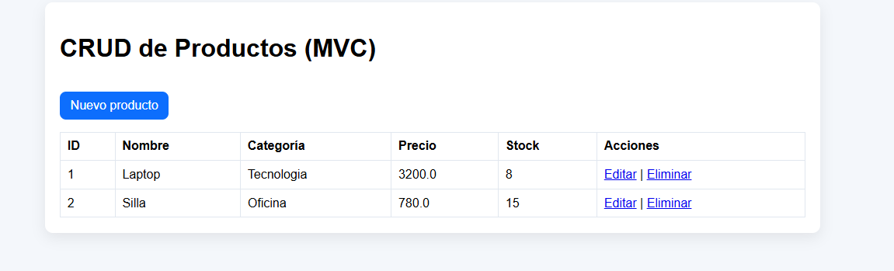
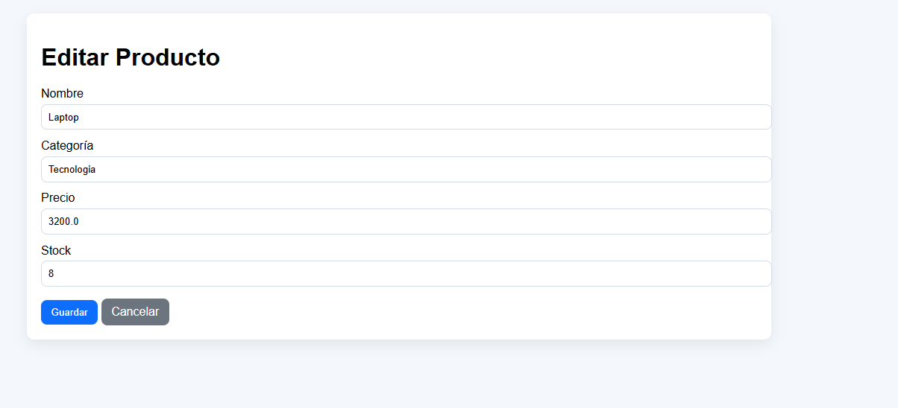
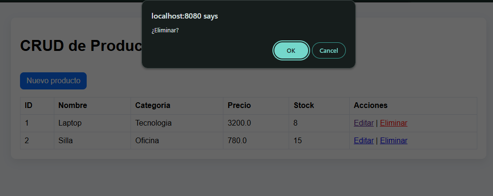
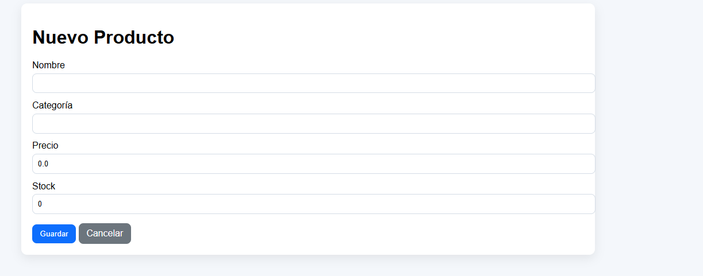

# daza-post1-u6

Proyecto Java Web MVC tradicional con CRUD de productos.

## Arquitectura

- Model: Producto, ProductoDAO
- Service: ProductoService
- Controller: ProductoServlet
- Views JSP: lista, formulario, error

## Funcionalidades

- Listar productos
- Crear producto
- Editar producto
- Eliminar producto
- Validaciones en servidor y PRG

## Prerrequisitos

- JDK 17+
- Maven 3.8+
- Tomcat 10.x

## Ejecución

1. `mvn clean package`
2. Desplegar el WAR en Tomcat
3. Navegar a `/mvc-productos/productos`

## Capturas

